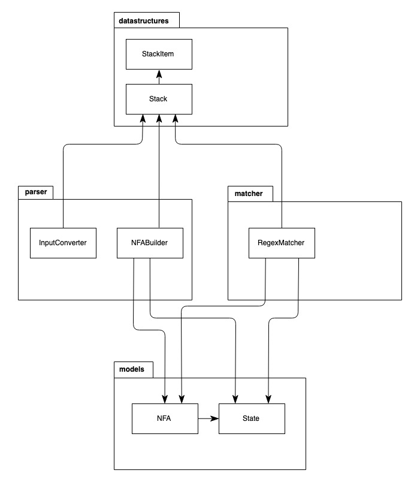

# Project implementation

## Project structure

The algorithm has two parts: the parsing of a regular expression into an NFA and the matching of an input text
 to the regex. The classes involved in the parsing are *InputConverter* and *NFABuilder*. First, the *InputConverter*
 adds concatenation characters to the regex given by the user and converts it into postfix notation. The *NFABuilder*
 then constructs the NFA based on the regex in postfix notation. The *RegexMatcher* is in charge of checking whether an
 input text matches the given regular expression. 
 
 Both *NFABuilder* and *RegexMatcher* are using the *NFA* and *State* models to represent the state machine. The
 algorithms for *InputConverter*, *NFABuilder*, and *RegexMatcher* are based on a stack and they use the implementation from the 
 *datastructures* package.
 
 ### Regex parsing
 
 The first step of the algorithm is to add concatenation characters to the regular expression. The algorithm loops over
 each character of the given regex, and adds concatenation characters (`.`) to mark which expressions should be concatenated.
 The character is added after each character of the input that is not an opening parenthesis or a pipe, and that is not
 followed by a closing parenthesis, a pipe or a Kleene star.
 
 Because the algorithm consists of a simple for-loop, its time complexity if O(n) for a regex of size n. In the worst case, the
 algorithm would add a concatenation character for each character in the given regex, it also has the space complexity of O(n).
 
 The second step of the algorithm transforms the regex with concatenation characters into a postfix notation. The algorithm 
 loops over each character of the input and uses a stack to hold encountered operators. By using the stack, the algorithm
 reverses the order of operators and expressions. It also takes into account the precedences of different operators.
 
 The time complexity of all stack operations is O(1), because the stack implementation uses a linked list and elements are
 only added to or removed from the beginning of the list. The algorithm loops through the input string once, so its time
 complexity is O(n) for an input of size n. The stack cannot contain more elements than there are characters in the input.
 Therefore its space complexity is O(n). The resulting postfix notation contains the same set of characters than the input
 string, except for parentheses which are omitted, so its space complexity is also O(n).
 
 ### NFA building
 
 The next step in the algorithm is building a NFA from the regex in postfix notation. It loops over the regex character
 by character. The algorithm uses a stack to hold NFAs. For each symbol character of the input, it builds the corresponding NFA
 and adds it to the stack. Each operator character will then combine these NFAs into a larger one which is then put back
 into the stack.
 
 NFA building uses the same stack where all operations happen in O(1). Because the algorithm loops over the regex only once, its
 time complexity is O(n). For each character in the regex except concatenation characters, 2 states are created and added to the NFA.
 The concatenation character takes two different states from NFAs in the stack and combines them into a single one. As a result,
 the number of states in the NFA is 2(n - c) - c, where n is the length of the regex and c is the number of concatenation
 characters in it. Therefore, the space complexity is O(n).
 
 ### Regex matching
 
 The last step in the algorithm is matching an input text to the regex. The algorithm starts in the start state of the NFA and
 all the states reachable from the start state through epsilon transitions. It loops over the characters in the input
 and finds the states of the NFA that can be reached from the previous set of states. After the loop is over, if the end 
 state of the NDA is part of the matching states, the regex matches the input text.
 
 The current set of reachable states is stored in a stack that does not contain duplicates. For each character in the input,
 the algorithm goes through the stack and finds all states that have a symbol transition that matches the current character.
 For each selected state, it follows the transitions until it has reached all states accessible through epsilon transitions.
 These states replace the previous set of reachable states.
 
 For each character of the input, the algorithm keeps track of the already visited states so it never visits the same one twice.
 For an input of size m and an NFA with n states, the time complexity of the algorithm is O(nm). The for-loop will be executed m
 times, and each of the n states can only be visited once per iteration.
 The stacks holding the current and next set of reachable states cannot have duplicates, therefore the space complexity of the
 algorithm is O(n).
 
 ## Limitations and future improvements
 
 The algorithm only supports a limited set of operators: `(`, `)`, `*` and `|`. Additional operators such as `?` and `+` would be easy
 to add in the future.
 Escaping characters is not currently possible. Because of this limitation, operator characters cannot be used as regular characters
 in regular expressions or inputs.
 The algorithm is also using the `.` character as the concatenation operator. As a result, this character cannot be used in regexes or
 input either. Another character could be chosen as the concatenation operator instead, but then it could not be used as a regular character.
 
 The algorithm could be improved further by transforming the NFA into a DFA, which would reduce the amount of states in the state machine.
 
 ### References
 - [Wikipedia: Thompson's construction](https://en.wikipedia.org/wiki/Thompson%27s_construction)
 - [Russ Cox: Regular Expression Matching Can Be Simple And Fast](https://swtch.com/~rsc/regexp/regexp1.html)