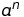
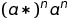

# Testing documentation

## Performance testing

The tests are measuring the time it takes to parse a regular expression and check for a match. The algorithm
performance is compared to the native Java regex and to grep. 
 
## Performance Measurements

The performances of the implementation and of the native Java regex matchers can be measured using the following command:

```
mvn compile exec:java -Dexec.mainClass=Measurements -Dexec.args="50"
```

The class takes as an argument the length of the regular expressions that should be given to the regex matchers. Regular 
expressions with different properties are built and tested sequentially with both implementations.

Measurements for the same regular expressions using grep can be made with the following command:

```
./performance-testing/measurement.sh 50
```

The argument also represents the length of the generated regular expressions.

## Results

Performances were measured for two different regex patterns.
The input string is always following the  pattern.

One of the regular expression is following the  pattern.
This is a straight forward match and should be fast to compute with any implementation.
The other regular expression is following the  pattern.
This pattern creates many more states in the NFA and many of them will be valid at all time, thus creating complexity.

### First regex pattern

All the results are in milliseconds.

|n| Own implementation | Java native| Grep |
|---:|---:|---:|---:|
| 100 | 0 | 0 | 7 |
| 500 | 0 | 0 | 9 |
| 1000 | 1 | 0 | 10 |
| 20000 | 275 | 218 | out of memory |
| 50000 | 1528 | 1263 | out of memory |

The algorithm is slightly slower than the native Java one but seems to grow at the same speed.
Grep does not seem to be able to match long regular expressions.

### Second regex pattern

|n| Own implementation | Java native| Grep |
|---:|---:|---:|---:|
| 5 | 0 | 0 | 7 |
| 10 | 0 | 0 | 7 |
| 12 | 0 | 8 | 7 |
| 15 | 0 | 52 | 7 |
| 20 | 1 | 2695 | 7 |
| 50 | 4 | over 10s | 7 |
| 100 | 16 | over 10s | 15 |
| 500 | 877 | over 10s | 545 |
| 1000 | 7637 | over 10s | 3970 |

Because the native Java implementation uses backtracking when traversing the NFA, its performances deteriorate quickly
with this regex pattern. The implemented algorithm avoids backtracking by keeping tracks of all possible states of the
NFA matching the input.

Even though it is slower than Grep, the measured values seem to grow at the same rate.

## Sources
- [Russ Cox: Regular Expression Matching Can Be Simple And Fast](https://swtch.com/~rsc/regexp/regexp1.html)