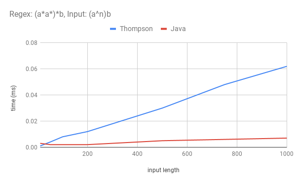

# Testing documentation

## Unit testing

The used data structures and algorithm logic is validated through unit tests using JUnit. Main class is not unit
tested. The test coverage report can be generated with the following command:
        ```
        mvn test jacoco:report
        ```
The report can be found under _target/site/jacoco/index.html_.

## Performance testing

The tests are measuring the time it takes to parse a regular expression and check for a match. The algorithm
performance is compared to the native Java regex from Java 8. 

Both Thompson's algorithm and the Java native algorithm are based on an NFA to represent the regular expression, but
they have a different strategy for finding if an input matches the regex. Thompson's algorithm traverses the graph once,
holding the set of all reachable states at the same time. The Java native algorithm uses backtracking. It tries to follow
a single path and backtracks if it does not find a match.

Performances were measured for two different regex patterns: `(a|aa)*b` and `(a*a*)*b`.
Each regex pattern is tested against two different types of input, one that matches the regular expressions and one
that matches except for the last character.
The matching input is of the form `(a^n)b`, n being the number of repetitions of `a`. For `n = 3` the input will be `aaab`.
Similarly, the non matching pattern is of the form `(a^n)c`.

## Results

Each result is the average of 10000 executions, except for the result marked with * which is the average of 100 executions.
All the times are in milliseconds.

#### Regex: `(a|aa)*b`

Regex pattern `(a|aa)*b` was tested against inputs of different lengths ranging from `n = 10` to `n = 2000`. The results
for the matching input are presented below:

**Input:** `(a^n)b`:

|n| Thompson | Java native|
|---:|---:|---:|
| 10 | 0.002 | 0.003 | 
| 50 | 0.004 | 0.004 | 
| 100 | 0.007 | 0.005 |
| 200 | 0.013 | 0.009 |
| 500 | 0.034 | 0.022 |
| 750 | 0.051 | 0.032 |  
| 1000 | 0.066 | 0.04 |
| 1200 | 0.073 | 0.048 |
| 2000 | 0.117 | Stack Overflow |


For both Thompson's algorithm and Java algorithm the processing time grows linearly with the input length. The Java native
algorithm is faster than the Thompson one with a matching input. However it starts producing Stack Overflow
exceptions for this regular expression if the input is longer than 1200 characters.

**Input:** `(a^n)c`:

|n| Thompson | Java native|
|---:|---:|---:|
| 10 | 0.001 | 0.004 | 
| 50 | 0.003 | 0.01 | 
| 100 | 0.007 | 0.016 |
| 200 | 0.013 | 0.032 |
| 500 | 0.035 | 0.073 |
| 750 | 0.054 | 0.111 |  
| 1000 | 0.066 | 0.157 |
| 1200 | 0.076 | 0.192 |
| 2000 | 0.115 | Stack Overflow |


Both algorithms' time complexity is also linear with the second input, however Thompson's algorithm is faster than the Java
one in this case.

Thompson's algorithm produces similar results for the two different inputs. In both situations, the algorithm is traversing
the NFA in the same way until the last character of the input is read. 

In comparison, the Java algorithm performs worse when the input almost matches the regular expression. When the input is a match,
the algorithm has to try different combinations of `a` and `aa` until the correct path is found. However, because the input
`(a^n)c` matches the input except for the last character, the algorithm will need to backtrack until all paths have been explored.

#### Regex: `(a*a*)*b`

**Input:** `(a^n)b`:

|n| Thompson | Java native|
|---:|---:|---:|
| 10 | 0.001 | 0.003 | 
| 50 | 0.004 | 0.002 | 
| 100 | 0.008 | 0.002 |
| 200 | 0.012 | 0.002 |
| 500 | 0.03 | 0.005 |
| 750 | 0.048 | 0.006 |
| 1000 | 0.062 | 0.007 |



For both Thompson's algorithm and Java algorithm the processing time grows linearly with the input length. The Java native
algorithm is clearly faster than the Thompson one with a matching input.

**Input:** `(a^n)c`:

|n| Thompson | Java native|
|---:|---:|---:|
| 10 | 0.001 | 0.017 |
| 50 | 0.003 | 1.226 |
| 100 | 0.009 | 8.613* | 
| 200 | 0.015 | 74,066* |
| 500 | 0.033 | 1150,010* |
| 750 | 0.05 | 3371.108* |
| 1000 | 0.064 | 8881,641* |


Thompson's algorithm is still linear for the almost matching input. However, the Java algorithm has an exponential time
complexity for this regular expression and input.

Once again Thompson's algorithm performs similarly for the two different inputs. It traverses the NFA in the same way until
the last character from the input. Because Thompson's algorithm follows all paths in parallel it does not need to backtrack
and requires the same amount of work weather the input is an exact match or almost a match.
 
The Java algorithm is fast for this regular expression with a matching input as it greedily matches all of the `a` characters
from the input and finds a matching path directly. The reason it is slow for an almost matching input is that the Kleene stars
from the regex pattern introduce many paths in the NFA. As the input matches except for the last character, the algorithm has
to backtrack continuously to try all combinations of the paths.

In the best case scenario, the Java native algorithm performs better than Thompson's algorithm. However, there are so-called
pathological regular expressions for which the Java native algorithm can have an exponential time complexity in the worst
case. Thompson's algorithm does not suffer from the same problem and performs reasonably well in all cases. Its complexity
is predictable and only depends on the length of the regular expression and the length of the input. However, the Java native
algorithm's complexity also depends on the type of regular expression it is evaluating.

## Performance Measurements

The performances of the Thompson's algorithm implementation and the native Java regex matchers can be measured
using the following command:

```
mvn compile exec:java -Dexec.mainClass=Measurements -Dexec.args="50"
```

The argument represents the size of the generated inputs.

## Sources
- [Russ Cox: Regular Expression Matching Can Be Simple And Fast](https://swtch.com/~rsc/regexp/regexp1.html)
- [Regular Expressions in Java](http://www.amygdalum.net/en/efficient-regular-expressions-java.html)